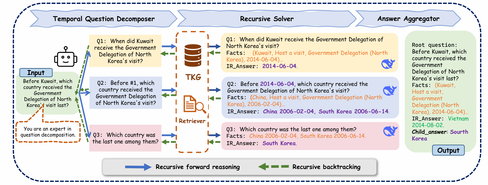

# RTQA

## 📖 Abstract
Current temporal knowledge graph question answering (TKGQA) methods primarily focus on implicit temporal constraints, lacking the capability of handling more complex temporal queries, and struggle with limited reasoning abilities and error propagation in decomposition frameworks.  

We propose **RTQA**, a novel framework to address these challenges by enhancing reasoning over TKGs **without requiring training**. Following recursive thinking, RTQA recursively decomposes questions into sub-problems, solves them bottom-up using LLMs and TKG knowledge, and employs **multi-path answer aggregation** to improve fault tolerance.  

RTQA consists of three core components:
- **Temporal Question Decomposer**  
- **Recursive Solver**  
- **Answer Aggregator**  

Experiments on **MultiTQ** and **TimelineKGQA** benchmarks demonstrate significant Hits@1 improvements in *Multiple* and *Complex* categories, outperforming state-of-the-art methods.

---

## 🔑 Main Idea

  

---
## ✅ Todo List

- [x] Our paper has been accepted to **EMNLP 2025** 🎉
- [ ] Release the code and resources before **2025-09-30**

